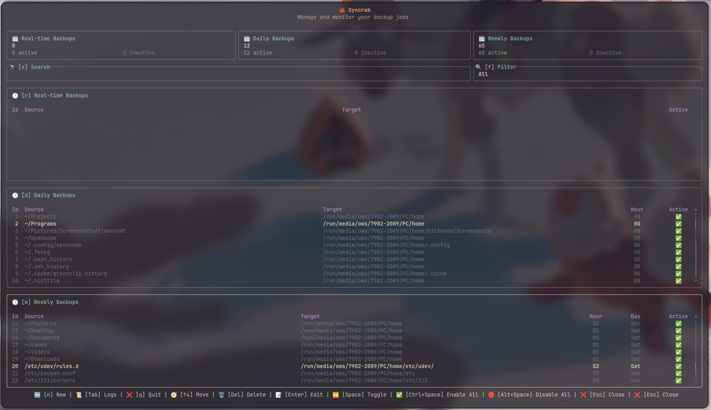
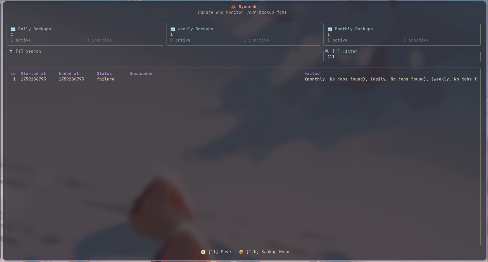
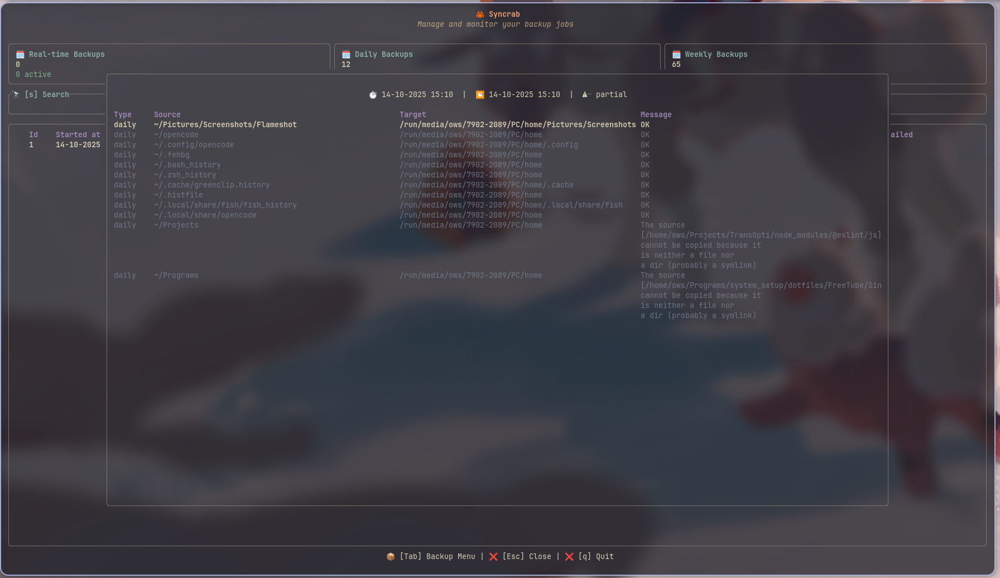

# **Syncrab** ✨

A Rust **TUI** and **CLI** for automating your backup jobs. Includes two binaries: a TUI and a batch performer.







---

## **Pre-Requisites** 🔧

1. **Rust**: Install `rustup` to compile and run. [(more on Rust)](https://www.rust-lang.org/tools/install).
2. **SQLite**: Install `sqlite` to store backup jobs & logs. [(more on SQLite)](https://sqlite.org/).

   For arch-based systems, you can use `yay`:
   ```bash 
   yay -S rustup sqlite --noconfirm && rustup default stable
   ```

   or `paru`:
   ```bash 
   paru -S rustup sqlite --noconfirm && rustup default stable
   ```

---

## **How to Use** 🚀

1. **Install**:

   ```bash
   git clone https://github.com/O-ELMA/syncrab.git && cd syncrab && bash ./install
   ```

2. **Run the TUI**:

   ```bash
   syncrab
   ```

3. **Run the backup job manually** (whenever you want):

   * `syncrab_b` accepts an optional frequency argument (`all`, `realtime`, `daily`, `weekly`), followed by an optional status (`active`, `inactive`):

     ```bash
     syncrab_b                  # sync active daily & weekly jobs that match the current hour and day
     syncrab_b all              # sync all jobs (active and inactive)
     syncrab_b realtime         # sync all realtime jobs (active and inactive)
     syncrab_b daily active     # sync only active daily jobs
     syncrab_b weekly inactive  # sync only inactive weekly jobs
     ```
4. **Uninstall**:

   Run the uninstall script:

   ```bash
   bash ./uninstall
   ```

---

## **Keymaps** 🗝️

You can use mouse clicks & scrolls across the majority of the app componets.

### **Field Keymaps:**
- `Left/Right arrows`: Move the cursor
- `Up/Down (or mouse scroll)`: Navigate between fields
- `Backspace & Del`: Delete characters
- `Ctrl+W`: Delete previous word
- `Ctrl+V`: Paste
- `Enter`: Save job

### **Table Keymaps:**
- `Up/Down (or mouse scroll)`: Scroll through jobs
- `Enter`: Open a job or log record
- `N`: Open new empty job form
- `Del`: Delete selected job
- `Ctrl+C`: Clone selected job
- `Space`: Toggle backup job activation
- `Alt+Space`: Disable all backup jobs in table
- `Ctrl+Space`: Enable all backup jobs in table

### **General Keymaps:**
- `f`: Next job filter
- `s`: Jump to search
- `r`: Jump to realtime table
- `d`: Jump to daily table
- `w`: Jump to weekly table
- `q`: Quit app
- `Tab`: Toggle between logs/jobs menus
- `Ctrl+r`: Replace a text accross all Jobs' Source & Target fields

---

## **Inputs** 📝

### **Source**

* **Type**: Text
* **Description**: The path of the file or folder that you want to copy somewhere else.

### **Target**

* **Type**: Text
* **Description**: The path of the destination folder where the source file/folder will be copied to.

### **Hour**

* **Type**: 2 digits (00-23)
* **Description**: The hour (24-hour format) when the job should run. This can be any number from 00 to 23.

### **Day**

* **Type**: 3 characters (Mon, Tue, Wed, Thu, Fri, Sat, Sun)
* **Description**: Specifies the day when the job should run. Use the three-letter abbreviation for the day (e.g., Mon for Monday, Tue for Tuesday...).


### **Usage Example & Default Behavior**

Suppose you enter the following paths:

* **📂 Source:** `/home/my files/My Pictures`
* **📂 Target:** `~/my hard drive/PC/Backed up Pictures`

When the backup runs:

1. The entire **`My Pictures`** folder, including all files and subfolders, will be copied **as a folder**, not just its contents.
   The resulting structure will be:

   ```
   ~/my hard drive/PC/Backed up Pictures/My Pictures/
   ```

2. If any folder mentioned in the target path does not already exist
   (e.g., `my hard drive`, `PC`, or `Backed up Pictures`),
   the application will automatically create it.

3. The `~` symbol is expanded to your home directory, i.e.: it will read as `/home/your_username` by the application.

