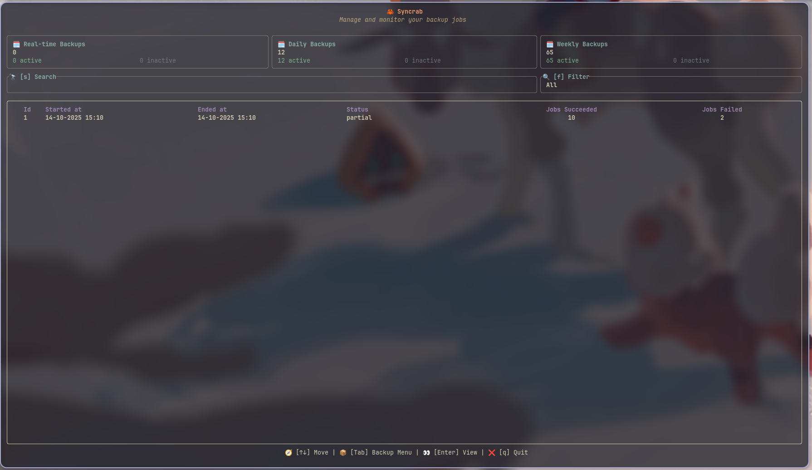

# **Syncrab** ✨

A Rust **TUI** and **CLI** for automating your backup jobs. Includes two binaries: a TUI and a batch performer.




---

## **Pre-Requisites** 🔧

1. **Rust**: Install `rustup` to compile and run. [(more on Rust)](https://www.rust-lang.org/tools/install).
2. **SQLite**: Install `sqlite` to store backup jobs & logs. [(more on SQLite)](https://sqlite.org/).

   ```bash 
   yay -S rustup sqlite --noconfirm && rustup default stable
   ```

---

## **How to Use** 🚀

1. **Install**:

   ```bash
   git clone https://github.com/O-ELMA/syncrab.git && cd syncrab && bash ./install
   ```

2. **Run the TUI**:

   ```bash
   syncrab
   ```

3. **Run the Backup job manually**:

   `pb` is mnemonic for `perform backup`.

   ```bash
   syncrab_pb
   ```

   * `syncrab_pb` can be run **without any arguments** or with `all`, `daily`, `weekly`, or `monthly` as an argument:

     ```bash
     syncrab_pb            # sync jobs accross all sections that match the the current hour and day's criteria
     syncrab_pb all        # sync all jobs
     syncrab_pb daily      # sync all daily jobs
     syncrab_pb weekly     # sync all weekly jobs
     syncrab_pb monthly    # sync all monthly jobs
     ```

4. 🚨 **Schedule automatic backups**:

   4.1. Open your crontab via:

   ```bash
   crontab -e
   ```

   4.2. then add the following line to run `syncrab_pb` every hour:

   ```bash
   0 * * * * /home/$USER/.cargo/bin/syncrab_pb
   ```

   4.3. and save the file.

5. **Uninstall**:

   Run the uninstall script:

   ```bash
   bash ./uninstall
   ```

---

## **Keymaps** 🗝️

You can use mouse clicks & scrolls across the majority of the app componets.

### **Field Keymaps:**
- `Left/Right arrows`: Move the cursor
- `Up/Down (or mouse scroll)`: Navigate between fields
- `Backspace & Del`: Delete characters
- `Ctrl+W`: Delete previous word
- `Ctrl+V`: Paste
- `Enter`: Save job

### **Table Keymaps:**
- `Up/Down (or mouse scroll)`: Scroll through jobs
- `Enter`: Open a job or log record
- `N`: Open new empty job form
- `Del`: Delete selected job
- `Space`: Toggle backup job activation
- `Alt+Space`: Disable all backup jobs in table
- `Ctrl+Space`: Enable all backup jobs in table

### **General Keymaps:**
- `f`: Next job filter
- `s`: Jump to search
- `d`: Jump to daily table
- `w`: Jump to weekly table
- `m`: Jump to monthly table
- `q`: Quit app
- `Tab`: Toggle between logs/jobs menus
- `Ctrl+r`: Replace a text accross all Jobs' Source & Target fields

---

## **Inputs** 📝

### **Source**

* **Type**: Text
* **Description**: The path of the file or folder that you want to copy somewhere else.

### **Target**

* **Type**: Text
* **Description**: The path of the destination folder where the source file/folder will be copied to.

### **Hour**

* **Type**: 2 digits (00-23)
* **Description**: The hour (24-hour format) when the job should run. This can be any number from 00 to 23.

### **Day**

* **Type**: 2 digits (0-31) for monthly jobs, 3 characters (Mon, Tue, Wed, etc.) for weekly jobs
* **Description**: Specifies the day when the job should run. Use a number between 01 and 31 for monthly jobs. For weekly jobs, use the three-letter abbreviation for the day (e.g., Mon for Monday, Tue for Tuesday...).
